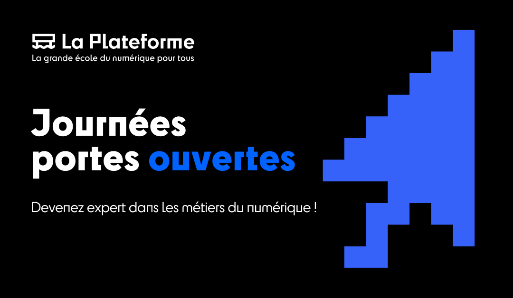
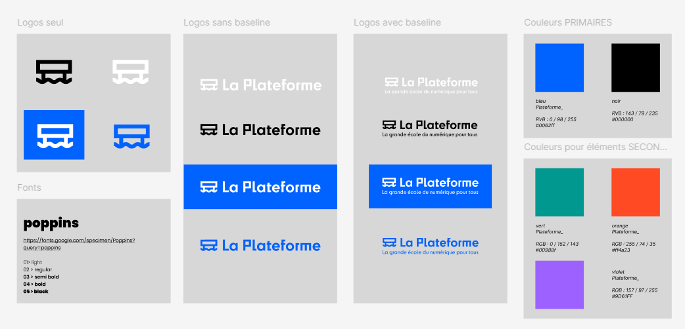

# ╰┈➤🚪 jpo-connect 🌐

 ~ Vous n'êtes qu'à un clic du changement de votre vie ! ~

  

## Table des matières

- [Le projet](#📢-le-projet)

  - [Le thème du sujet](#le-thème-du-sujet)
  - [Contexte de réalisation](#contexte-de-réalisation)

- [Technologies](#💻-technologies)

  - [Langages](#langages-🖱️)
  - [Technologies](#technologies-⌨️)
  - [Outils de conception](#outils-de-conception-💾)

- [Ressources](#📁-ressources)

  - [User Story](#user-story)
  - [Maquettes](#maquette)
    - [Mobil First](#mobile-first)
    - [Laptop](#laptop)
    - [Schéma](#les-schémas)
  - [Base de données](#base-de-données)

- [Titillons votre curiosité](#😉-titillons-votre-curiosité)

- [Accées](#🔗-site)

# 📢 Le projet

## Le thème du sujet

Chaque année, La Plateforme organise des
journées portes ouvertes pour faire découvrir son programme et les opportunitées qu'elle peut offir.

Ces évènements sont un défi de taille pour l’équipe marketing !

Afin d'améliorer leur productivité, nous avons développer un outil numérique et digital permettant aux futurs étudiants, ainsi qu’à leurs parents, de s’inscrire aux journées portes ouvertes.

Cette plateforme sert de point central pour la gestion et l’administration des JPO.

## Contexte de réalisation

Dans le cadre de notre projet de fin d'année à La Plateforme, nous disposions d'un délai de deux semaines pour le mener à bien.

A l'aide de divers outils de gestion tels que Trello et GitHub, nous avons pu suivre notre progression, la gestion du code source et la collaboration de l'équipe.

En suivant cette démarche professionnalisante, nous avons commencé par créer une maquette détaillée (zoning, wireframe, maquette graphique, prototype) pour visualiser l'interface utilisateur et les fonctionnalités prévues.

Nous avons ensuite élaboré les modèles conceptuel (MCD), logique (MLD) et physique (MPD) des données, afin de structurer notre base de données de manière claire et précise. Notre principal objectif était de construire une base de données robuste, garantissant ainsi une utilisation efficace et une réalisation optimale du site.

# 💻 Technologies

## Langages 🖱️

- PHP

- MySQL

- JavaScript

- CSS

- ReactJS

- Typescript

## Technologies ⌨️

- DomPDF

## Outils de concepetion 💾

- Trello

- Figma

- Lucid Chart

# 📁 Ressources

## User Story

- schéma du user story avec une légende

## Maquette

La création de la maquette permet de produire les premiers visuels d'une application. Il est essentiel de choisir les bons emplacements, de structurer correctement les éléments et de définir une charte graphique cohérente afin de garantir une production efficace lors de la phase de programmation.

Dans un souci de praticité, la conception de la version mobile est réalisée en premier. Cela facilite par la suite le placement et la conception de la version pour les écrans d'ordinateur.

### Mobile first

 

  

 

Maquette de la version mobile, 320px min 

### Laptop

 

  

 

Maquette de la version laptop, 1024px min 

### Les schémas

- Zoning

 

  

 

Schéma du zoning

Le zoning indique l'emplacement des différents éléments présents sur le site. Il permet de structurer la page web de manière schématique en utilisant des blocs principaux.

- Wireframe

 

  

 

Schéma du wireframe

Le wireframe permet de positionner les éléments dits "call to action" et de définir l'emplacement des différents composants du site. Il permet de déterminer les détails présents sur la page de manière schématique.

- Charte graphique

 

  

 

Charte graphique de l'application

Pour ce projet, notre charte graphique s'aligne avec les couleurs du centre de formation. Nous y retrouvons les différents logo, les couleurs principale, secondaire et tertinaire que nous disponsons en respectant la formule 60% - 30% - 10% et la police d'écriture.
 
 

- Design

 

  

 

Schéma du rendu escompté de l'application

Le design représente la dernière étape de la composition. Il intègre la charte graphique, les effets de style et les animations dynamiques auxquels l'utilisateur sera confronté.
 

## Base de données

- MCD

 

  

 

Schéma du MCD

La construction de la base donnée débute par le MCD. Il nous permet de déterminer et de confirmer les premières tables.

- MLD

 

  

 

Schéma du MLD

Ce schéma nous permet de déterminer les clés primaires (Primary Key) et les clés étrangères (Foreign Key). Il présente les premières liaisons et dépendances qui structurent la base de données. On y retrouve également les cardinalités qui confirment les relations entre les entités.

- MPD

 

  

 

Schéma du MPD

Dans ce schéma, nous ajoutons les champs pour identifier tous les éléments présents dans la base de données. Les liaisons sont plus détaillées et comportent les symboles nécessaires à la reconnaissance des relations.

- MySQL

 

  

 

Image de la base de données

Enfin, nous remplissons la base de données MySQL pour pouvoir manipuler l'ensemble de ces données et procéder à la mise en place des différentes requêtes dans le code.

# 😉 Titillons votre curiosité

Allez, on vous montre une ébauche de cette application !

  

# 🔗 Site

Mettre le lien du site
